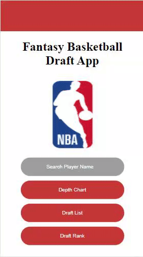

# Fantasy Basketball App

An app that allows user to create a mock fantasy draft list for the upcoming NBA season. Data for this app are courtesy of https://www.balldontlie.io/ and https://www.fantasybasketballnerd.com/

# Technologies Used
* Javascript
* CSS3
* HTML5

# Live Demo
Try the application live at https://boyul-kim.github.io/Fantasy-Basketball-App/

# Features
* User can search a player and view: Historical Stats over the past 5 years & Projected Stats for the upcoming year
* User can view Depth Charts for each team and by each position (clicking on their names will direct them to the player's profile)
* User can add a player from their profile into their mock draft list
* User can view the projected draft rank of the top 200 players (clicking on their names will direct them to the player's profile)

# Planned Features
* Mock Draft Simulator
* Data analytic funtionality for when the season actually starts
* Make the design of the app more aesthetically pleasing

# Preview

